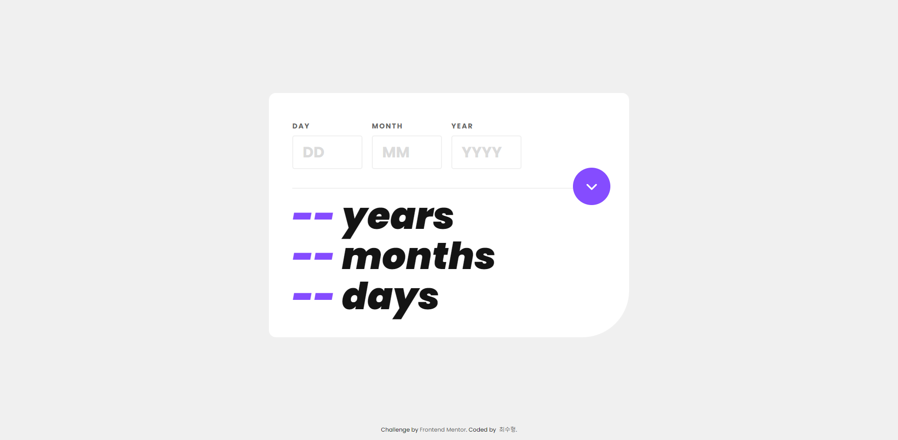

# chat app css illustration master

## 목차(INDEX)

- [chat app css illustration master](#chat-app-css-illustration-master)
  - [목차(INDEX)](#목차index)
  - [개요(SUMMARY)](#개요summary)
    - [스크린샷(SCREENSHOT)](#스크린샷screenshot)
  - [내 작업(MY WORK)](#내-작업my-work)
    - [사용한 것(WHAT I USE)](#사용한-것what-i-use)
    - [배운 점(WHAT I LEARN)](#배운-점what-i-learn)
    - [향후 주목할 분야(NOTABLE POINT)](#향후-주목할-분야notable-point)
    - [참고 링크(LINKS)](#참고-링크links)
  - [작성자(AUTHOR)](#작성자author)

## 개요(SUMMARY)

[프론트엔드 멘토](https://www.frontendmentor.io/home)에서 시행한 세 번째 챌린지.

The third challenge I started with [Frontend Mentor](https://www.frontendmentor.io/home).

### 스크린샷(SCREENSHOT)

## 내 작업(MY WORK)

### 사용한 것(WHAT I USE)

- Day.js
- Date 객체
- validation

### 배운 점(WHAT I LEARN)

- npm 모듈 사용에 대해 좀 더 알아봐야 할 것 같다
- 모듈 사용 또한 cdn으로 불러올 수 있다
- 유효성 평가 작성 시 고려해야 하는 것들

### 향후 주목할 분야(NOTABLE POINT)

- 모듈 사용
- 날짜 계산
- 유효성 검사

### 참고 링크(LINKS)

- ## 사용한 폰트 (Font Used)

  -[Poppins](https://fonts.google.com/specimen/Poppins)

- ## 사용 모듈 (Modul Used)
  - [Day.js](https://day.js.org/)

## 작성자(AUTHOR)

**최수형(SOOHYEONG CHOI)**

- [github](https://github.com/User850413)
- [velog](https://velog.io/@user850413)

